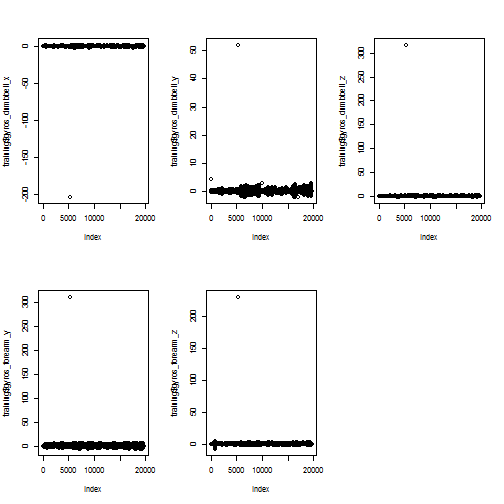
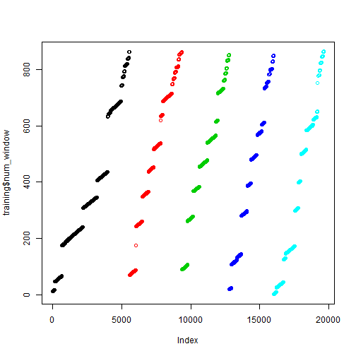

# Project for Practical Machine Learning: predicting with activity data.

## Introduction
Personal activities like self movement are collected relatively easily these days, and
in this project, we analyze data from accelerometers on the belt, forearm. arm, and
dumbbell of 6 participants,
while they were asked to perform barbell lifts correctly and incorrectly 
in 5 different ways. 

## Data
Two data files are given in the *csv* format.

```r
training <- read.csv("pml-training.csv")
testing <- read.csv("pml-testing.csv")
dim(training)
```

```
## [1] 19622   160
```

```r
dim(testing)
```

```
## [1]  20 160
```

One file is a training set of 19,622 observations with 159 predictors and 1 outcome.
While the other file is a test set of 20 observations with 159 predictors and no outcome.
One of our goals is finding the outcome of the test set from the second file 
using one of machine learning techniques we learned in this course.

Now we can check if there is any NA in the data set. First, we can see that
some predictors are all NAs in the testing set.

```r
naColumns <- numeric()
for (i in 1:160) {
  if (sum(is.na(testing[,i]))==length(testing[,i])) naColumns<-c(naColumns,i)
}
length(naColumns)
```

```
## [1] 100
```

```r
sum(is.na(training[,-naColumns]))
```

```
## [1] 0
```

This indicates that there are 100 predictors of all NAs in the test set,
and if we remove those same coulmns from both of the training and test sets,
there are no more NAs. 
Therefore, we will remove these predictors from both training and testing sets 
from here on.

```r
training <- training[,-naColumns]
testing <- testing[,-naColumns]

sum(is.na(training))
```

```
## [1] 0
```

```r
sum(is.na(testing))
```

```
## [1] 0
```

Next, we will find outliers. By looking at predictors one by one, we found some
outliers.

```r
par(mfrow=c(2,3))
plot(training$gyros_dumbbell_x)
plot(training$gyros_dumbbell_y)
plot(training$gyros_dumbbell_z)
plot(training$gyros_forearm_y)
plot(training$gyros_forearm_z)
```

 

These five outliers are all from one observation (row 5373). So we delete this observation 
(row 5373). Also the column 1 is just the index, the column 2 is the user name, columns 3-5 
are time stamps, and columns 6 and 7 (new_window and num_window) don't
seem suitable for analysis. 
For example, properties of num_window variable are
shown in the figure below using colors representing outcomes. 
We can also see that the training data set is sorted using classes and 
num_window variables, and that certain values of num_window directly corresponds
to the outcome somehow. 

```r
plot(training$num_window,col=training$classe)
```

 

Therefore, we delete these variables (columns 1-7), too.
Now we have 52 predictors and 19,621 observations for the training set.

```r
training <- training[-5373,]
training <- training[,-(1:7)]
testing <- testing[,-(1:7)]
dim(training)
```

```
## [1] 19621    53
```

```r
dim(testing)
```

```
## [1] 20 53
```

## Analysis
We will build a model using the *caret* package of R.
The cross-validation will be done by *train* function.
The default cross-validation method is boostraping (25 times),
but it was very time-consuming with given number of observations.
So the K-fold method (K=5) was selected using
*trainControl* function.
For the model, the decision tree was chosen at first, but the accuracy,
which is 1 - (out-of-sample error), was around 0.5.
This is not good enough, even though it took just seconds to compute.

```r
library(caret)
```

```
## Loading required package: lattice
## Loading required package: ggplot2
```

```r
library(rpart)
set.seed(12345)
ctrl <- trainControl(method="cv", number=5)
dtFit <- train(classe~., data=training, method="rpart", 
               trControl=ctrl)
dtFit
```

```
## CART 
## 
## 19621 samples
##    52 predictors
##     5 classes: 'A', 'B', 'C', 'D', 'E' 
## 
## No pre-processing
## Resampling: Cross-Validated (5 fold) 
## 
## Summary of sample sizes: 15699, 15696, 15695, 15698, 15696 
## 
## Resampling results across tuning parameters:
## 
##   cp    Accuracy  Kappa  Accuracy SD  Kappa SD
##   0.04  0.5       0.4    0.01         0.01    
##   0.06  0.4       0.3    0.07         0.1     
##   0.1   0.3       0.07   0.04         0.07    
## 
## Accuracy was used to select the optimal model using  the largest value.
## The final value used for the model was cp = 0.04.
```

Next, the random forest has been chosen by setting
*method* as "rf". The accracy was extremely good (>99%). but
it took almost two hours to compute
even with the K-fold (K=5) cross-validation instead of the bootstrapping.

```r
set.seed(67890)
ctrl <- trainControl(method="cv", number=5)
rfFit <- train(classe~., data=training, method="rf", 
               trControl=ctrl, prox=TRUE)
```

```
## Loading required package: randomForest
## randomForest 4.6-7
## Type rfNews() to see new features/changes/bug fixes.
```

```r
rfFit
```

```
## Random Forest 
## 
## 19621 samples
##    52 predictors
##     5 classes: 'A', 'B', 'C', 'D', 'E' 
## 
## No pre-processing
## Resampling: Cross-Validated (5 fold) 
## 
## Summary of sample sizes: 15697, 15696, 15697, 15696, 15698 
## 
## Resampling results across tuning parameters:
## 
##   mtry  Accuracy  Kappa  Accuracy SD  Kappa SD
##   2     1         1      0.001        0.001   
##   30    1         1      0.001        0.001   
##   50    1         1      0.002        0.003   
## 
## Accuracy was used to select the optimal model using  the largest value.
## The final value used for the model was mtry = 2.
```

## Summary
Now that we found the prediction model with the good accracy, we 
will apply the model to the testing set.

```r
rfPred <- predict(rfFit, testing)
rfPred
```

```
##  [1] B A B A A E D B A A B C B A E E A B B B
## Levels: A B C D E
```
The result show all 20 predictions for the testing set, and the predictions are 
all correct (graded in the course website already).

In summary, we analyzed the activity data for five classes of movements, and
found a prediction model using the random forest with 5-fold cross-validation.
The model had an extremely low out-of-sample error (< 1%), and it gave us 
the 100% correct predictions for the given test set.
